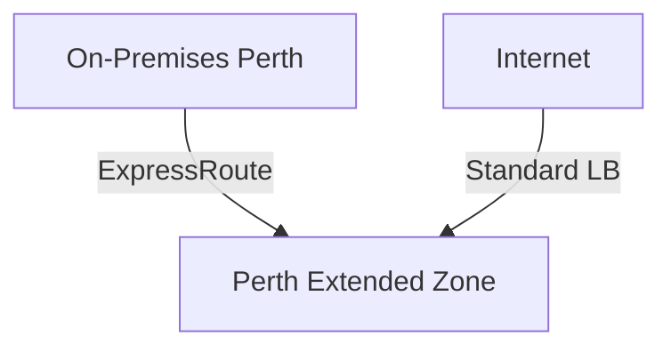
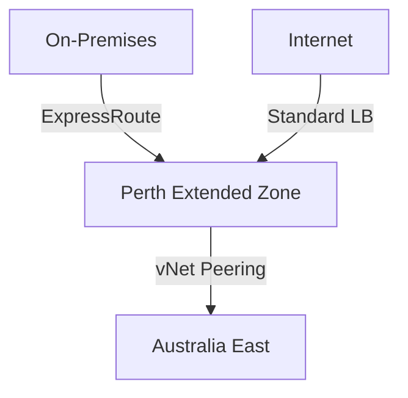

# Perth Extended Zone

## Customer Playbook — SpecDev Overview

**Version 1.2 | May 2025**

  <a href="https://DonFarCreative.github.io/Perth-Extended-Zone/" target="_blank" class="text-xl slidev-icon-btn opacity-50 !border-none !hover:text-white">
    📖 Full Playbook
  </a>

<!--
Welcome to the Perth Extended Zone SpecDev presentation.
This playbook provides technical guidance for deploying workloads to the Azure Perth Extended Zone.
-->

---
transition: fade-out
---

# Agenda

<v-clicks>

1. [🌏 What are Azure Extended Zones?](/3)
2. [📍 Perth Extended Zone Overview](/5)
3. [🏗️ Deployment Scenarios](/6)
4. [⚙️ Service Availability](/7)
5. [🌐 Networking & Connectivity](/10)
6. [🔄 Business Continuity & DR](/12)
7. [🔒 Security & Compliance](/13)
8. [📋 Design Decisions & Recommendations](/14)
9. [🚀 Next Steps](/16)

</v-clicks>

---
transition: slide-up
layout: two-cols
layoutClass: gap-16
---

# What are Azure Extended Zones?

<v-clicks>

- **Small-footprint extensions** of an Azure region
- Located in metropolitan areas & industry hubs
- Support VMs, containers, storage, select services
- **Control plane** → parent region
- **Data plane** → Extended Zone site
- Integrated into **Microsoft global network**

</v-clicks>

::right::

## Two Key Scenarios

| Scenario | Description |
|:---------|:------------|
| **Latency** | Run resources close to end users |
| **Data Residency** | Keep data within a specific geography |

---
layout: center
class: text-center
---

# Perth Extended Zone

## Why It Matters

---
transition: slide-left
---

# Perth Extended Zone — Why It Matters

### 🎯 Key Benefits

- Fulfil **data residency** and compliance obligations
- Minimise **workload latency** for Perth-based users
- Achieve **sustainability goals**

### 📍 Key Facts

- **Parent Region:** Australia East (Sydney)
- **Single-zone location**
- **Compliance:** ISO 27001 · SOC 2 Type II · PCI DSS

> 💡 Store and process data **within Western Australia** — fulfilling data residency obligations while leveraging Azure's global platform.

---
transition: slide-up
---

# Deployment Scenarios

## Scenario 1: Standalone

Deploy workloads **without connecting** to a parent region landing zone.

## Scenario 2: Extension

**Extend an existing landing zone** to include the Perth Extended Zone.

**Connectivity Options:** ExpressRoute (NextDC P1) · Site-to-Site VPN (ISV) · Standard Load Balancer

---
transition: fade
---

# Service Availability

| Category | Services |
|:---------|:---------|
| **Compute** | AKS, AVD, VMSS, VMs (A/B/D/E/F + GPU NVadsA10 v5) |
| **Networking** | ExpressRoute, DDoS, Private Link, Standard LB, vNet, vNet Peering |
| **Storage** | Managed Disks, Premium Blobs/Files, ADLS Gen2, SFTP, NFS |
| **BCDR** | Azure Site Recovery, Azure Backup |
| **Arc-enabled** | PostgreSQL, Managed SQL, Container Apps (Preview) |

<v-click>

### 🔮 Roadmap (Post-GA)
Application Gateway · VPN Gateway · NAT Gateway · Azure Firewall

</v-click>

---
transition: slide-left
---

# SLA Summary

| Area | Service | Uptime SLA | Service Credit |
|:-----|:--------|:-----------|:---------------|
| **Compute** | VM / VMSS | < 99.9% | 10% |
| **Storage** | Premium Files / Blobs | Per SLA page | — |
| **Networking** | Network Availability | Per SLA page | — |

<v-click>

⚠️ Extended Zones are **single-zone locations** — SLAs reflect this constraint. For details, refer to the [Microsoft SLA page](https://www.microsoft.com/licensing/docs/view/Service-Level-Agreements-SLA-for-Online-Services).

</v-click>

---
transition: slide-up
---

# ISV Solutions

| Vendor | Product | Status |
|:-------|:--------|:-------|
| **Aviatrix** | Secure Networking Platform | ✅ Completed |
| **Fortinet** | FortiGate NGFW | ✅ Completed |
| **Checkpoint** | CloudGuard Network Security | 🔄 Validating |
| **Citrix** | DaaS | 🔄 Validating |
| **F5 Network** | Big IP BYOL | 🔄 Validating |
| **Palo Alto** | VM-Series NGFW | 🔄 Validating |
| **Red Hat** | RHEL | 🔄 Validating |

---
transition: slide-left
layout: two-cols
layoutClass: gap-16
---

# Networking — Topology

<v-clicks>

### Standalone
- Traditional Hub-and-Spoke ✅
- Single vNet ✅
- Virtual WAN Hub ❌

### Extension
- Traditional + **vNet peering** to parent ✅
- vNet peering to parent **Virtual WAN** ✅

</v-clicks>

::right::

### ExpressRoute (Preferred)

| Detail | Value |
|:-------|:------|
| **Peering** | NextDC P1 |
| **Partners** | Equinix, Megaport, NextDC |
| **Standard** | Oceania region |
| **Premium** | Global connectivity |
| **Local** | ❌ Not supported |
| **SLA** | 99.95% uptime |

---
transition: fade
---

# Outbound & Inbound Internet

### ⬆️ Outbound Internet

<v-clicks>

- ❌ **No default outbound route**
- ✅ Network Virtual Appliance
- ✅ Load Balancer (SNAT)
- ✅ Instance-Level Public IP
- 🔮 Azure Firewall *(roadmap)*
- 🔮 NAT Gateway *(roadmap)*

</v-clicks>

### ⬇️ Inbound Internet

<v-clicks>

- ✅ Standard Load Balancer *(Standard SKU, Regional tier only)*
- ✅ Network Virtual Appliance
- 🔮 Application Gateway *(roadmap)*

</v-clicks>

⚠️ The default outbound route is being phased out across all Azure regions by September 2025. Azure Extended Zones launch without it.

---
transition: slide-up
---

# Business Continuity & DR

### Availability

- ❌ Availability Sets — **not supported**
- ✅ **VMSS** — compute resilience
- ✅ **Load Balancer** — fault tolerance
- ✅ **LRS** — 3x replication within zone

### Recovery

| Scenario | Backup | ASR |
|:---------|:-------|:----|
| EZ → Parent Region | ✅ | ✅ |
| On-prem → EZ | ❌ | ❌ |
| EZ → EZ | — | ❌ |

<v-click>

⚠️ Recovery Services Vaults must be created in an **Azure Region**, not within Extended Zones. Azure Migrate is **not supported** for Extended Zones.

</v-click>

---
transition: slide-left
---

# Security & Compliance

### 🛡️ Security Services

- **NSGs** — auto-created in parent region
- **Private Link** — private endpoint access
- **DDoS Protection** — plan in parent region
- **Defender for Cloud** — CSPM recommended
- **Microsoft Sentinel** — SIEM/SOAR

### 📋 Compliance

| Standard | Status |
|:---------|:-------|
| ISO 27001 | ✅ |
| SOC 2 Type II | ✅ |
| PCI DSS | ✅ |

### 📍 Data Residency
Data processed within **Western Australia**

> Some limited scenarios may store data outside your selected geography. Consult the Azure Data Residency documentation.

---
transition: fade
---

# Key Design Decisions

| Decision | Recommendation |
|:---------|:---------------|
| **Subscription** | Dedicate specific subscriptions for Extended Zone |
| **Resource Groups** | Create in parent region with clear naming convention |
| **Bastion** | Deploy in parent region, use global vNet peering |
| **Logs** | Log Analytics workspace in parent region |
| **Action Groups** | Create global action groups |
| **Quotas** | Managed via parent region |
| **Boot Diagnostics** | Managed only (no custom storage accounts) |
| **DNS** | Customer-managed DNS server (Private DNS Resolver not supported) |

---
transition: slide-up
---

# Pricing Highlights

<v-clicks>

- 💰 Priced **separately** from Azure Regions at a **premium**
- ✅ **EA discounts** apply · **CSP agreements** supported
- ❌ **Reserved Instances / Savings Plans** — not currently supported
- 🔄 **Network transfers** — categorised as Inter-Region
- 🌐 **ExpressRoute** — Zone 2 pricing
- 🤝 **vNet Peering** (Perth ↔ Australia East) — treated as **same region**

</v-clicks>

> 📞 Contact your Microsoft account team for detailed pricing.

---
layout: center
class: text-center
transition: fade
---

# Next Steps

<v-clicks>

1. 📝 **Register subscriptions** for Extended Zone access
2. 📞 **Engage your Microsoft account team** for pricing and timelines
3. ⚙️ **Assess service requirements** against availability
4. 🌐 **Plan network topology** — Standalone or Extension
5. 🔄 **Design BCDR strategy** around supported scenarios
6. 📖 **Review the full playbook** on GitHub Pages

</v-clicks>

---
layout: center
class: text-center
---

# Thank You

**Perth Extended Zone Customer Playbook**

Version 1.2 — May 2025

[📖 Full Playbook](https://DonFarCreative.github.io/Perth-Extended-Zone/) · [💻 GitHub Repo](https://github.com/DonFarCreative/Perth-Extended-Zone)

© Microsoft Corporation. All rights reserved.

