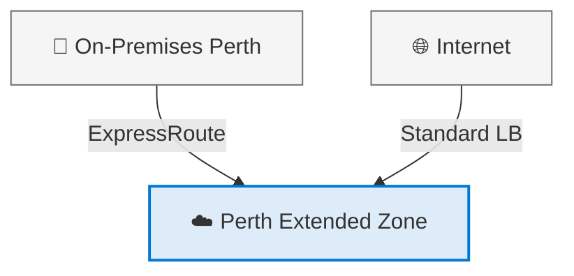
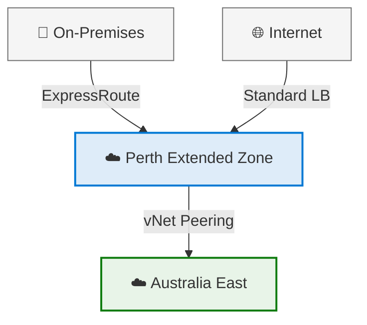

---
layout: cover
---

# Perth Extended Zone

## Customer Playbook

Version 1.2 — May 2025

Accelerate cloud adoption in Western Australia with low-latency, data-resident Azure services.

<!--
Welcome to the Perth Extended Zone SpecDev presentation.
This playbook provides technical guidance for deploying workloads to the Azure Perth Extended Zone.
-->

---
transition: fade-out
---

# Agenda

<h4>🌏 <a href="/4">What are Azure Extended Zones?</a></h4>

Small-footprint extensions of Azure regions

<h4>📍 <a href="/6">Perth Extended Zone Overview</a></h4>

Why it matters for Western Australia

<h4>🏗️ <a href="/7">Deployment Scenarios</a></h4>

Standalone and Extension patterns

<h4>⚙️ <a href="/8">Service Availability</a></h4>

Available services, SLAs, and ISVs

<h4>🌐 <a href="/11">Networking & Connectivity</a></h4>

Topologies, ExpressRoute, internet access

<h4>🔄 <a href="/13">Business Continuity & DR</a></h4>

Availability, backup, and recovery

<h4>🔒 <a href="/14">Security & Compliance</a></h4>

Security services and data residency

<h4>📋 <a href="/15">Design Decisions</a></h4>

Key recommendations and pricing

---
layout: section
---

# What are Azure Extended Zones?

## Small-footprint extensions of Azure — close to your users

---
layout: two-cols
transition: slide-up
---

# Azure Extended Zones

<v-clicks>

<h4>☁️ Small-Footprint Extensions</h4>

Strategically located in metropolitan areas, industry hubs, or specific jurisdictions

<h4>🏗️ Architecture</h4>

<strong>Control plane</strong> remains in parent region · <strong>Data plane</strong> deployed at Extended Zone site

<h4>🌐 Global Network</h4>

Integrated into Microsoft's global network for secure, reliable, high-bandwidth connectivity

</v-clicks>

::right::

### Two Key Scenarios

<h4>⚡ Latency</h4>

Run resources close to end users with minimal latency

<h4>📍 Data Residency</h4>

Keep application data within a specific geography for privacy, regulatory, and compliance reasons

Supports VMs · Containers · Storage · Select Azure Services

---
layout: section
---

# Perth Extended Zone

## Why It Matters for Western Australia

---

# Perth Extended Zone — Why It Matters

<h4>🏛️ Data Residency</h4>

Fulfil data residency and compliance obligations by storing and processing data <strong>within Western Australia</strong>

<h4>⚡ Low Latency</h4>

Minimise workload latency for <strong>Perth-based users</strong> and applications

<h4>🌱 Sustainability</h4>

Achieve sustainability goals with local infrastructure

### 📍 Key Facts

| Detail | Value |
|:-------|:------|
| **Parent Region** | Australia East (Sydney) |
| **Zone Type** | Single-zone location |
| **ISO 27001** | ✅ Compliant |
| **SOC 2 Type II** | ✅ Compliant |
| **PCI DSS** | ✅ Compliant |

---
transition: slide-up
---

# Deployment Scenarios

Scenario 1: Standalone

Deploy workloads **without connecting** to a parent region landing zone.

Scenario 2: Extension

**Extend an existing landing zone** via vNet peering over the Microsoft backbone.

---
transition: fade
---

# Service Availability

| Category | Available Services | Status |
|:---------|:-------------------|:-------|
| **Compute** | AKS, AVD, VMSS, VMs (A/B/D/E/F + GPU NVadsA10 v5) | ✅ GA |
| **Networking** | ExpressRoute, DDoS, Private Link, Standard LB, vNet, vNet Peering | ✅ GA |
| **Storage** | Managed Disks, Premium Blobs/Files, ADLS Gen2, SFTP, NFS | ✅ GA |
| **BCDR** | Azure Site Recovery, Azure Backup | ✅ GA |
| **Arc-enabled** | PostgreSQL, Managed SQL, Container Apps | 🔄 Preview |

<v-click>

🔮 Roadmap (Post-GA)

<h4>Application Gateway</h4>

<h4>VPN Gateway</h4>

<h4>NAT Gateway</h4>

<h4>Azure Firewall</h4>

</v-click>

---
transition: slide-left
---

# SLA & ISV Solutions

### Service Level Agreements

| Area | Service | SLA |
|:-----|:--------|:----|
| **Compute** | VM / VMSS | 99.9% |
| **Storage** | Premium Files/Blobs | Per SLA |
| **Network** | Availability | Per SLA |

⚠️ Single-zone location — SLAs reflect this.

### ISV Validation

| Vendor | Status |
|:-------|:-------|
| **Aviatrix** | ✅ Complete |
| **Fortinet** | ✅ Complete |
| **Checkpoint** | 🔄 Validating |
| **Citrix** | 🔄 Validating |
| **F5 Network** | 🔄 Validating |
| **Palo Alto** | 🔄 Validating |
| **Red Hat** | 🔄 Validating |

---
layout: section
---

# Networking & Connectivity

## Topologies, ExpressRoute, and Internet Access

---
layout: two-cols
transition: slide-left
---

# Network Topology

<v-clicks>

<h4>Standalone — Traditional</h4>

Hub-and-Spoke or single vNet ✅

<h4>Standalone — Virtual WAN</h4>

vWAN Hub not supported ❌

<h4>Extension — Traditional</h4>

vNet peering to parent region ✅

<h4>Extension — Hybrid vWAN</h4>

vNet peering to parent vWAN ✅

</v-clicks>

::right::

### ExpressRoute Details

| Detail | Value |
|:-------|:------|
| **Peering Location** | NextDC P1 |
| **Partners** | Equinix, Megaport, NextDC |
| **Direct** | ExpressRoute Direct |
| **Standard SKU** | Oceania region |
| **Premium SKU** | Global connectivity |
| **Local SKU** | ❌ Not supported |
| **SLA** | 99.95% uptime |

> 💡 **DR tip:** Deploy a second circuit to parent region PoP (e.g., Sydney) or use site-to-site VPN as fallback.

---
transition: fade
---

# Internet Access

### ⬆️ Outbound Options

<h4>Network Virtual Appliance</h4>

ISV NVAs (F5, Palo Alto, Cisco) ✅

<h4>Load Balancer (SNAT)</h4>

Standard LB with public IP ✅

<h4>Instance-Level Public IP</h4>

Direct VM internet access ✅

<h4>Azure Firewall & NAT GW</h4>

On the roadmap 🔮

### ⬇️ Inbound Options

<h4>Azure Standard Load Balancer</h4>

Standard SKU, Regional tier only ✅

<h4>Network Virtual Appliance</h4>

ISV ingress inspection ✅

<h4>Application Gateway</h4>

On the roadmap 🔮

<blockquote v-click style="font-size: 0.8em; margin-top: 0.5em;">
⚠️ <strong>No default outbound route</strong> — phased out across all Azure regions by Sept 2025.
</blockquote>

---
transition: slide-up
---

# Business Continuity & DR

Availability

<h4>VMSS</h4>

Compute resilience ✅

<h4>Load Balancer</h4>

Fault tolerance ✅

<h4>LRS Storage</h4>

3x replication in zone ✅

<h4>Availability Sets</h4>

Not supported ❌

Recovery

| Scenario | Backup | ASR |
|:---------|:-------|:----|
| EZ → Parent | ✅ | ✅ |
| On-prem → EZ | ❌ | ❌ |
| EZ → EZ | — | ❌ |

Recovery Vaults: parent region only

Migration

<h4>Azure Migrate</h4>

Not supported for Extended Zones 🔮

Consult your Microsoft account team for migration guidance.

---
transition: slide-left
layout: two-cols
---

# Security & Compliance

<v-clicks>

<h4>🛡️ Network Security Groups</h4>

Auto-created in parent region

<h4>🔗 Azure Private Link</h4>

Private endpoint access to PaaS

<h4>🛑 DDoS Protection</h4>

Plan in parent region, protects EZ

<h4>🔍 Defender for Cloud</h4>

CSPM recommended

<h4>📡 Microsoft Sentinel</h4>

SIEM & SOAR

</v-clicks>

::right::

### Compliance Standards

| Standard | Status |
|:---------|:-------|
| **ISO 27001** | ✅ Compliant |
| **SOC 2 Type II** | ✅ Compliant |
| **PCI DSS** | ✅ Compliant |

### Data Residency

Data processed **within Western Australia**.

Some limited scenarios may store data outside selected geography.

---
transition: fade
---

# Key Design Decisions

| Decision | Recommendation |
|:---------|:---------------|
| **Subscription** | Dedicate specific subscriptions for Extended Zone |
| **Resource Groups** | Create in parent region with clear naming convention |
| **Bastion** | Deploy in parent region, use global vNet peering |
| **Logs** | Log Analytics workspace in parent region |
| **Action Groups** | Create global action groups |
| **Quotas** | Managed via parent region |
| **Boot Diagnostics** | Managed only (no custom storage accounts) |
| **DNS** | Customer-managed DNS (Private DNS Resolver ❌) |

<v-click>

<blockquote class="mt-4">
💡 Resource groups <strong>cannot be created</strong> within an Extended Zone — establish them in the parent region with a naming convention that clearly identifies Extended Zone resources.
</blockquote>

</v-click>

---
transition: slide-up
---

# Pricing & Billing

<h4>💰 Premium Pricing</h4>

Priced separately from Azure Regions at a premium

<h4>✅ EA & CSP</h4>

Enterprise Agreement discounts and CSP agreements apply

<h4>❌ Savings Plans</h4>

Reserved Instances and Cost Savings Plans not currently supported

### Network Pricing

| Transfer Type | Classification |
|:-------------|:---------------|
| **Data Centre** | Inter-Region |
| **ExpressRoute** | Zone 2 |
| **vNet Peering** (Perth ↔ AE) | Same region |

> 📞 Contact your **Microsoft account team** for detailed pricing information.

---
layout: center
transition: fade
---

# Next Steps

1

<h4>Register</h4>

Register subscriptions for Extended Zone access

2

<h4>Engage</h4>

Contact Microsoft account team for pricing & timelines

3

<h4>Assess</h4>

Evaluate service requirements against availability

4

<h4>Design</h4>

Plan network topology & BCDR strategy

5

<h4>Deploy</h4>

Deploy workloads to the Perth Extended Zone

---
layout: end
---

# Thank You

## Perth Extended Zone Customer Playbook

Version 1.2 — May 2025

[📖 Full Playbook](https://DonFarCreative.github.io/Perth-Extended-Zone/) · [💻 GitHub Repo](https://github.com/DonFarCreative/Perth-Extended-Zone)

© Microsoft Corporation. All rights reserved.
